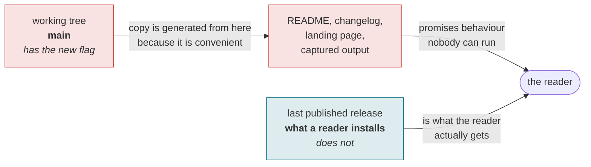

# unreleased-guard

[](LICENSE)
[-0b7285)](https://efaimo.ai/skills)
[](https://github.com/efaimo-ai/unreleased-guard/actions/workflows/house-style.yml)

An Agent Skill. **Public copy describes what a reader can actually get, not what
your working tree can do.** This is the discipline for the interval in between,
which opens by itself the moment a feature merges and closes only when you
publish.

```
Skill: unreleased-guard
```

Drop the directory into your skills path. Nothing to install, no dependencies:
`SKILL.md` plus one reference file.

## The gap, which opens by itself



The gap opens the moment a feature merges and closes only on publish. Every
document written inside it is wrong on arrival, and no gate notices, because the
working tree agrees with itself.

## The problem

The repository is the most convenient source of truth and the wrong one. Anyone
writing documentation is reading the working tree; everyone reading it is
running the last published version. Between merge and publish those are
different software, and nothing warns you, because the code is right, the docs
are right about the code, and the tests pass.

The result is a package page promising a flag that errors out for whoever
installs it. It is not a mistake people make once. It is the default outcome of
documenting what is in front of you.

## The move

1. Bump the version the moment the tree diverges from a tag. Two builds calling
   themselves 0.1.0 make every capture untraceable.
2. Annotate unreleased behaviour inline, where the line sits, so a reader
   skimming for something to copy hits the annotation first.
3. State the gap once, at the top of whatever a new contributor reads first.
4. Strip the annotations in the commit **before** the tag. Registries render the
   tagged tree, so there is exactly one commit where this is right.
5. Tie the claim to the released version with a check, not a convention.
6. After publishing, re-measure everything that quoted the old version.

## The part that is easy to miss

If your docs quote real command output, regenerating a capture during an open
gap stamps the unreleased version into a document about the released one. The
numbers can be identical and it is still wrong. During a gap, captures are
frozen, and the freeze has to be written where the regeneration happens rather
than where the document lives, because that regeneration is almost always done
for an unrelated reason by someone not thinking about the gap.

## Provenance

Every step here is from a CLI that has been through four releases with this gap
open each time, including the one that produced the rule about the commit before
the tag. `references/the-gap.md` has the mechanism, the check, and the table of
three moments where only one works.

## License

Apache-2.0. See `LICENSE` and `NOTICE`.


## The set

Seven skills, each one a discipline that cost something to learn.

| skill | the question it asks |
|---|---|
| [`red-before-green`](https://github.com/efaimo-ai/red-before-green) | can this check fail at all? |
| [`denominator`](https://github.com/efaimo-ai/denominator) | how much of the world can it see? |
| [`read-back`](https://github.com/efaimo-ai/read-back) | did the write actually apply? |
| [`claim-sweep`](https://github.com/efaimo-ai/claim-sweep) | what else still asserts the old value? |
| **`unreleased-guard`** (this one) | does the copy describe what shipped? |
| [`honest-chart`](https://github.com/efaimo-ai/honest-chart) | is the picture proportional to the data? |
| [`mcp-stateless-migration`](https://github.com/efaimo-ai/mcp-stateless-migration) | does this server match the 2026-07-28 spec? |

All of them are audited by [`efaimo`](https://github.com/efaimo-ai/efaimo), the
CLI that measures the quality and context-window cost of MCP servers and Agent
Skills. The index of every public skill it can find, graded, is at
[efaimo.ai/skills](https://efaimo.ai/skills).

## License

Apache-2.0. See [`LICENSE`](LICENSE) and [`NOTICE`](NOTICE).
