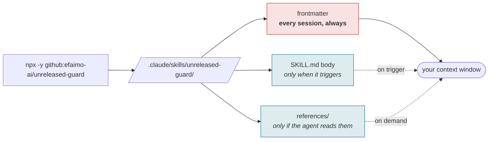
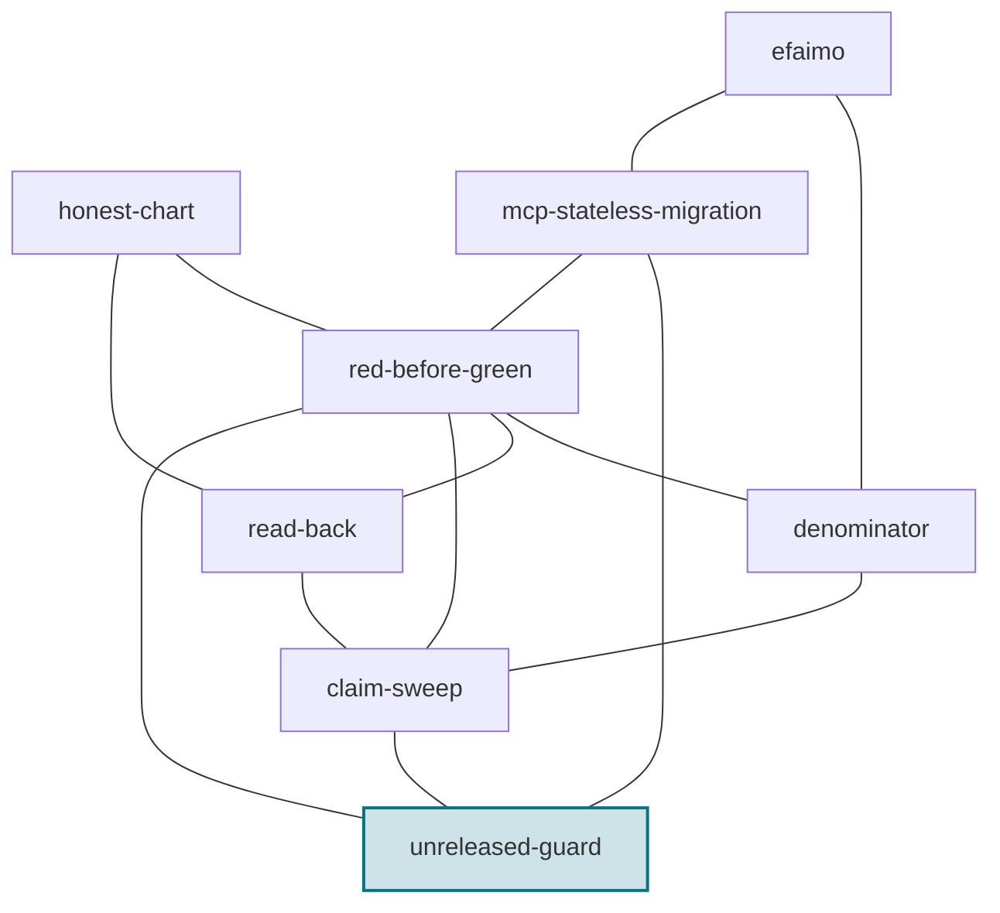

# unreleased-guard

[](LICENSE)
[-0b7285)](https://efaimo.ai/skills)
[](https://github.com/efaimo-ai/unreleased-guard/actions/workflows/house-style.yml)

An Agent Skill. **Public copy describes what a reader can actually get, not what
your working tree can do.** This is the discipline for the interval in between,
which opens by itself the moment a feature merges and closes only when you
publish.

```
Skill: unreleased-guard
```

No runtime, no dependencies, nothing to configure: `SKILL.md` plus one
reference file, and any way of getting that directory onto your skills path
works.

<!-- generated:install -->

## Install

```sh
# into ./.claude/skills/unreleased-guard/
npx -y github:efaimo-ai/unreleased-guard

# into ~/.claude/skills/unreleased-guard/, for every project
npx -y github:efaimo-ai/unreleased-guard --global

# installed already, and still current?
npx -y github:efaimo-ai/unreleased-guard --check
```

That is the repository, not the registry, and it is deliberate: `unreleased-guard` is
not on npm yet, and a README that prints `npx unreleased-guard` today would be
advertising a command that 404s. The line above works right now. The day the
package publishes it becomes `npx unreleased-guard`, and this README is regenerated from
a committed registry probe rather than from anybody's memory.

The package is the skill: `SKILL.md` and its `references/`, nothing else. The
installer copies them, reads every byte back, and fails if what landed is not
what it wrote. It refuses to overwrite a directory whose contents differ unless
you pass `--force`, and installing the same version twice is a success rather
than a conflict.

Or take it by hand. It is markdown; `npx -y github:efaimo-ai/unreleased-guard --print` writes `SKILL.md` to
stdout, and the repository is the whole thing.

<!-- /generated:install -->

## The gap, which opens by itself


The gap opens the moment a feature merges and closes only on publish. Every
document written inside it is wrong on arrival, and no gate notices, because the
working tree agrees with itself.

## The problem

The repository is the most convenient source of truth and the wrong one. Anyone
writing documentation is reading the working tree; everyone reading it is
running the last published version. Between merge and publish those are
different software, and nothing warns you, because the code is right, the docs
are right about the code, and the tests pass.

The result is a package page promising a flag that errors out for whoever
installs it. It is not a mistake people make once. It is the default outcome of
documenting what is in front of you.

## The move

1. Bump the version the moment the tree diverges from a tag. Two builds calling
   themselves 0.1.0 make every capture untraceable.
2. Annotate unreleased behaviour inline, where the line sits, so a reader
   skimming for something to copy hits the annotation first.
3. State the gap once, at the top of whatever a new contributor reads first.
4. Strip the annotations in the commit **before** the tag. Registries render the
   tagged tree, so there is exactly one commit where this is right.
5. Tie the claim to the released version with a check, not a convention.
6. After publishing, re-measure everything that quoted the old version.

## The part that is easy to miss

If your docs quote real command output, regenerating a capture during an open
gap stamps the unreleased version into a document about the released one. The
numbers can be identical and it is still wrong. During a gap, captures are
frozen, and the freeze has to be written where the regeneration happens rather
than where the document lives, because that regeneration is almost always done
for an unrelated reason by someone not thinking about the gap.

## Provenance

Every step here is from a CLI that has been through four releases with this gap
open each time, including the one that produced the rule about the commit before
the tag. `references/the-gap.md` has the mechanism, the check, and the table of
three moments where only one works.

## License

Apache-2.0. See `LICENSE` and `NOTICE`.


<!-- generated:pipeline -->

## What installing it does to a session

A skill is not free just because it is markdown. Its frontmatter is loaded at
the start of every session for every skill you have installed, whether or not it
ever fires.



In this skill's case, measured by [efaimo](https://github.com/efaimo-ai/efaimo) `weigh` (v0.5.0, 2026-09-04):
**96 tokens always resident**, 1,143 when it triggers, 997 across 1 reference file if the agent reads to the end.

<!-- /generated:pipeline -->

<!-- generated:set -->

## The set

Every skill in this set is about a report that was true about the wrong thing.

| skill | something reported | what the report was really about |
|---|---|---|
| [`red-before-green`](https://github.com/efaimo-ai/red-before-green) | a check said clean | whether it ran at all |
| [`denominator`](https://github.com/efaimo-ai/denominator) | a check said clean | how much of the world it saw |
| [`read-back`](https://github.com/efaimo-ai/read-back) | a write said done | whether it applied |
| [`claim-sweep`](https://github.com/efaimo-ai/claim-sweep) | a change said done | everything else still asserting the old value |
| **`unreleased-guard`** | a document said true | which version it is true of |
| [`honest-chart`](https://github.com/efaimo-ai/honest-chart) | a picture said the data | whether its geometry is proportional |
| [`mcp-stateless-migration`](https://github.com/efaimo-ai/mcp-stateless-migration) | a server said ok | which revision it speaks |
| [`efaimo`](https://github.com/efaimo-ai/efaimo) | a tool said A(100) | what a grade certifies, and what it costs |



Each edge is a real handoff, not a category: the reason one skill points at
another is written into it at [efaimo.ai/skills](https://efaimo.ai/skills), and
in the `Siblings` section of every `SKILL.md`. All of them are graded and
weighed by [`efaimo`](https://github.com/efaimo-ai/efaimo), the CLI that measures
what an agent loads.

<!-- /generated:set -->

## License

Apache-2.0. See [`LICENSE`](LICENSE) and [`NOTICE`](NOTICE).
